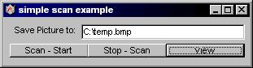



## Scanning / Capturing Pictures w/ Scanner or WebCam

### Description

Ever wanted to scan a picture and save it to the Hard Drive? Well Now You Can. With a Few Lines of Code you're ready to capture a picture from a webcam or scan something from a flatbed. This may only be compatible with certain brands of scanners and webcams but should work with most. The only thing not coded by me in this sample is the control which is included. I think it was built by kodak. Anyhows enjoy. Be sure to Extract the .OCX to your Windows\System directory or most likely this will not work.
 
### More Info
 

             |
---                |---
**Submitted On**   |2000-04-12 02:44:42
**By**             |[Rey](https://github.com/Planet-Source-Code/PSCIndex/blob/master/ByAuthor/rey.md)
**Level**          |Intermediate
**User Rating**    |5.0 (35 globes from 7 users)
**Compatibility**  |VB 5\.0, VB 6\.0
**Category**       |[Files/ File Controls/ Input/ Output](https://github.com/Planet-Source-Code/PSCIndex/blob/master/ByCategory/files-file-controls-input-output__1-3.md)
**World**          |[Visual Basic](https://github.com/Planet-Source-Code/PSCIndex/blob/master/ByWorld/visual-basic.md)
**Archive File**   |[CODE\_UPLOAD47114122000\.zip](https://github.com/Planet-Source-Code/rey-scanning-capturing-pictures-w-scanner-or-webcam__1-7188/archive/master.zip)

